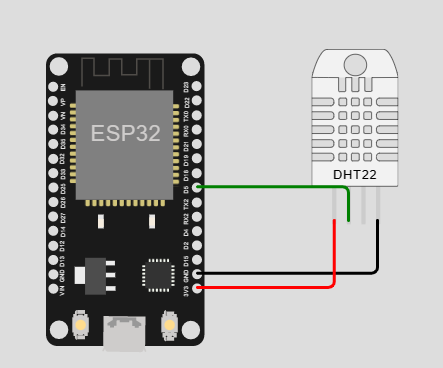
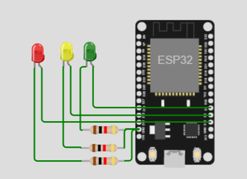

# posttest3-praktikum-iot-unmul

- 2009106017 Riska Nurliyanti
- 2009106026 Sulhairah
- 2009106045 Cantika Fitri Ayu Darmayanti

#Judul studi kasus
MONITORING DAN KONTROLLING SUHU RUANGAN

#Deskripsi
Jika suhu di bawah 20 derajat celcius lampu hijau akan menyala, 
suhu di sekitar 21-26 derajat celcius lampu kuning akan menyala, 
dan jika suhu di atas 27 derajat celcius maka lampu merah menyala.
program di monitoring melalui blynk dan MQTT

#Pembagian Tugas
- control led lampu hijau (Sulhairah)
- control led lampu kuning (Cantika)
- control led lampu merah (Riska)
- sensor suhu dan subscriber (Riska)
- blynk dan publisher (Sulhairah)
- rangkaian wokwi dan publisher(cantika)

#Komponen yang Digunakan
- Bread Board
- DHT11
- LED
- Resistor
- Kabel Jumper
- ESP8266

#Board Schematic

  

  

